# Stable Diffusion IOT

### Integrantes:

- Christian Geovany Muñoz Rodríguez
- Gerson Ismael Flores Sánchez
 
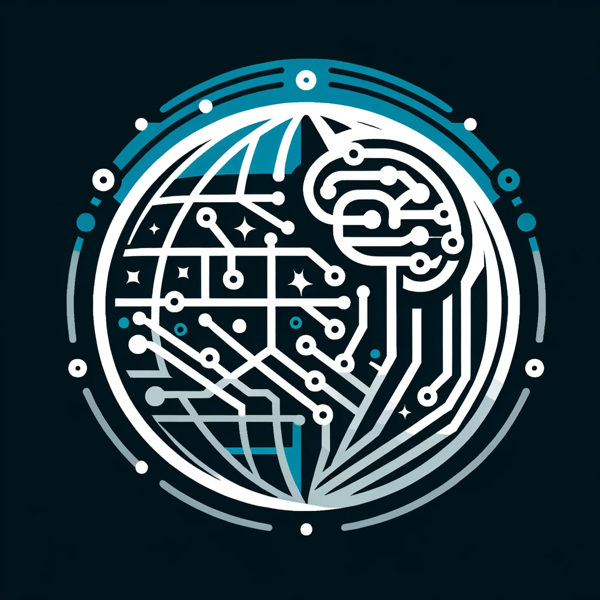

## Descripción

Este es un proyecto que busca fusionar la inteligencia artificial generativa con los sistemas de IoT para crear una aplicación que genere imágenes  a partir de un prompt ingresado por el usuario, pero alterado por las condiciones del ambiente. 

El proyecto se divide en  partes importantes:

**1. Stable Diffusion**:  Es el modelo open source para generación de imágenes más popular. Además de ser de libre acceso, ha demostrado una calidad y eficiencia que no tiene nada que envidiarle a modelos clousure como DALL-E o Midjourney. Además, tiene capacidades de personalización muy interesantes y un gran soporte de la comunidad.
Nuestro plan es desplegar este modelo como un servicio a través de una API, para que pueda ser utilizado por cualquier persona que quiera generar imágenes a partir de un prompt.

**2. ESP32 y sensores**: Para la parte de IoT, utilizaremos un ESP32 con sensores de temperatura, humedad y luz. Estos sensores serán utilizados para alterar el prompt ingresado por el usuario, de manera que la imagen generada refleje las condiciones del ambiente en el que se encuentra el usuario. Nos hubiera gustado incorporar  geolocalización o visión computacional para una experiencia más inmersiva, pero por cuestiones de tiempo y recursos, decidimos limitarnos a estos sensores, por lo que este proyecto es una versión simplificada de una idea más grande que tenemos en mente.

**3. Frontend**: Para la interfaz de usuario, utilizaremos una aplicación web sencilla que permita al usuario ingresar un prompt y visualizar la imagen generada. Además, se mostrarán los valores de los sensores en tiempo real, para que el usuario pueda ver cómo afectan a la imagen generada. Incluimos otro apartado donde el usuario podra elegir entre diferentes estilos de imagen para la generación de la misma.

## Interfaz de usuario

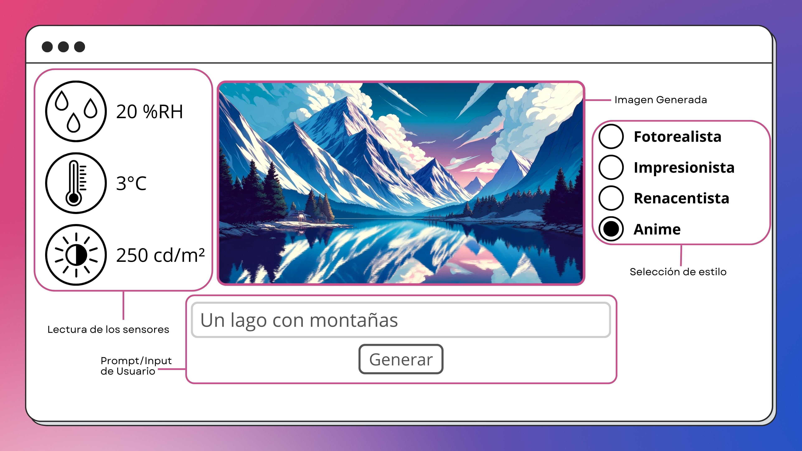

Planeamos que la interfaz de usuario sea lo más sencilla e intuitiva posible. El usuario podrá ingresar un prompt en un campo de texto y presionar un botón para generar la imagen. Además, podrá ver los valores de los sensores en tiempo real o lo más cercano a tiempo real posible. También podrá elegir entre diferentes estilos de imagen para la generación de la misma.

## Funcionamiento

El usuario ingresa un prompt en la interfaz de usuario y presiona un botón para generar la imagen. Como podemos ver en esta imagen que rescatamos de la descripción de la interfaz de usuario, el usuario solicita una imagen de un lago con montañas. Los censores de luminosidad y humedad muestran datos normales, sin embargo,  el usuario solicita una imagen en estilo anime y el sensor marca una temperatura de 2 grados. Esto nos da como resultado una imagen de un lago con montañas nevadas en estilo anime, debido a la baja temperatura y el estilo de imagen seleccionado.

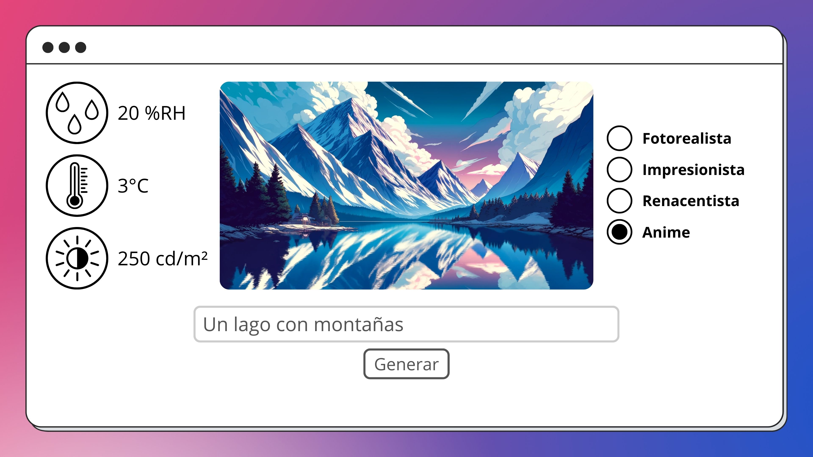

Ahora, imaginemos que el usuario solicita que ahora el estilo de imagen sea renacentista. El resultado sería similar a la imagen anterior, pero con un estilo de pintura de la época del renacimiento.

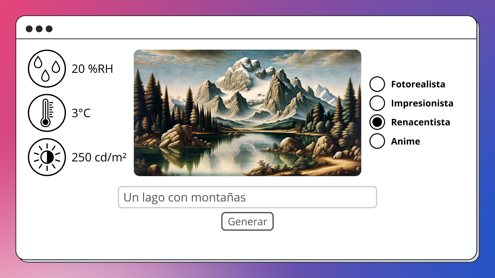

Ahora, si el sensor de luminosidad detecta que la habitación está muy oscura, la imagen generada podría ser una versión más oscura de la imagen anterior, para reflejar las condiciones del ambiente.

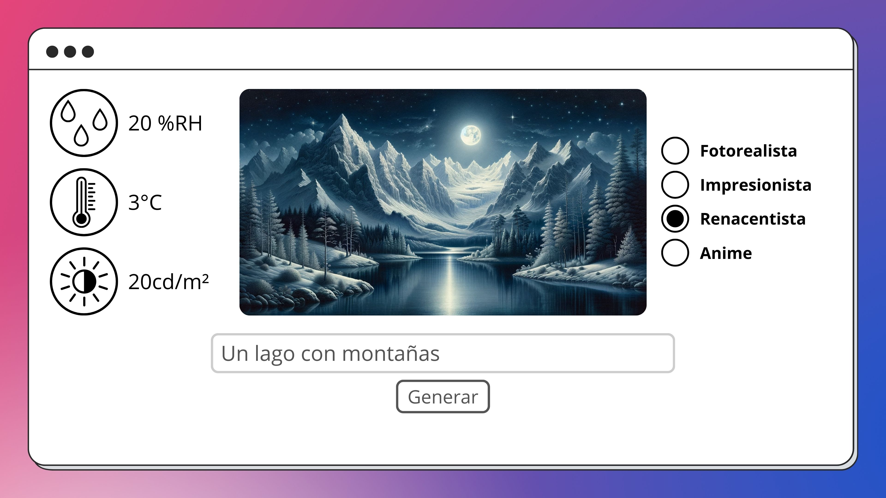

Si el sensor de humedad detecta que la habitación está muy húmeda, la imagen generada podría ser una versión de la imagen anterior con lluvia.

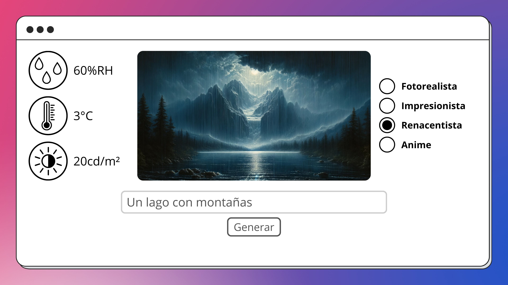

Supongamos que el sensor de temperatura detecta que la habitación está muy caliente. La imagen generada reflejaría un ambiente cálido,  o de incendio, como se muestra en la imagen a continuación.

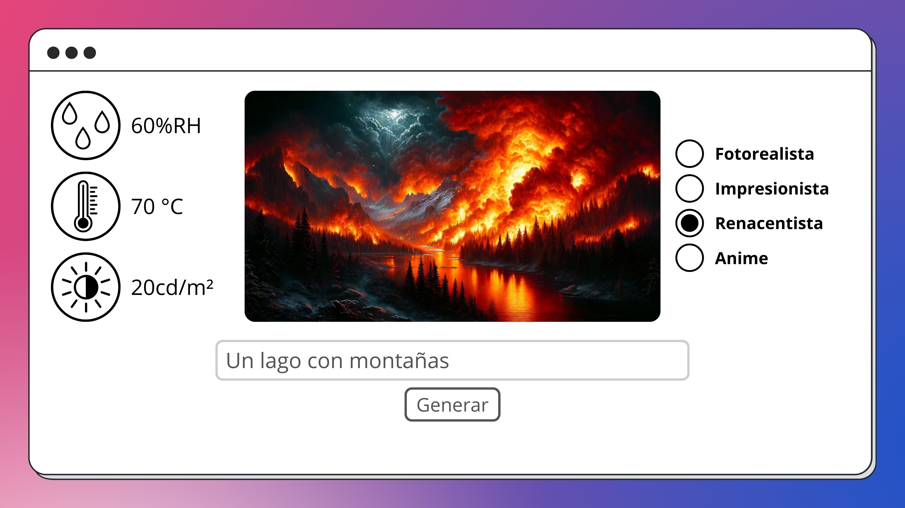

## Arquitectura

La arquitectura del proyecto se divide en tres partes principales: el frontend, el backend y el ESP32.

**1. Frontend**: La interfaz de usuario se desarrollará con Vue.js, Bootstrap y Node.js.

**2. Backend**: El backend se desarrollará FastAPI, que es un framework de Python para la creación de APIs de manera rápida y sencilla. Aún no sabemos como desplegar el modelo de Stable Diffusion como un servicio, pero estamos investigando diferentes opciones. Por ejemplo:

- PaaS como Heroku, Netlify o Railway.
- IaaS como AWS.
  
Todo dependerá de la complejidad del despliegue y de los recursos que tengamos disponibles.

**3. ESP32**: El ESP32 se encargará de leer los valores de los sensores y enviarlos al backend a través de una conexión. Para la conexión.

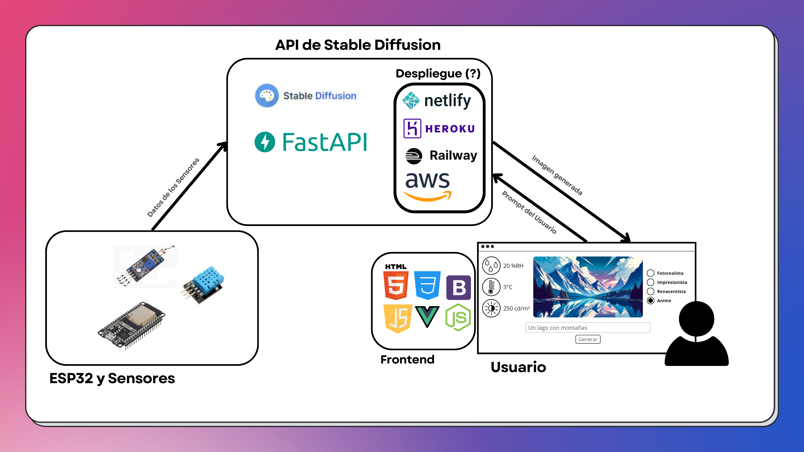

# Pesentación

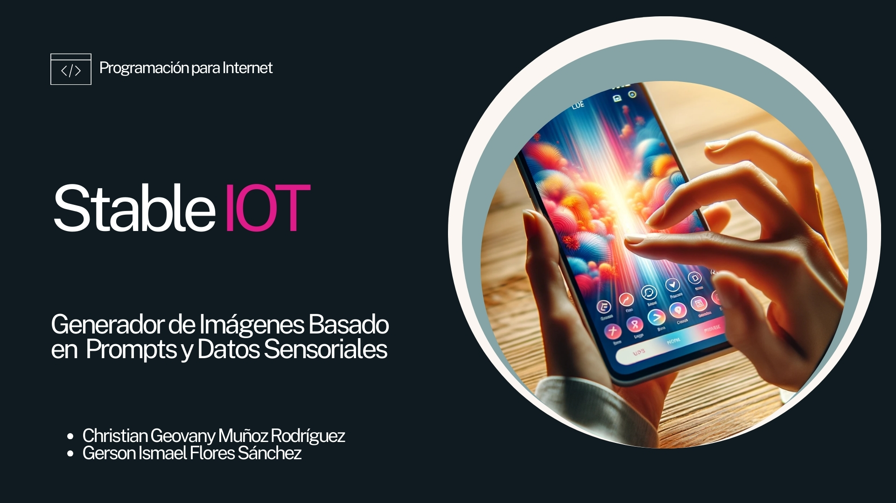

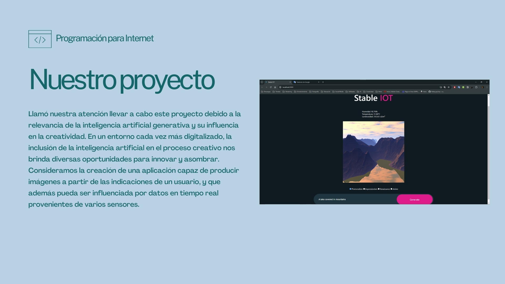

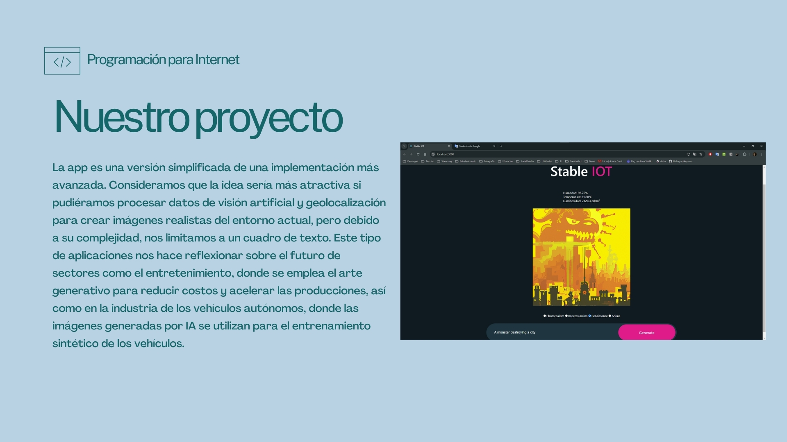

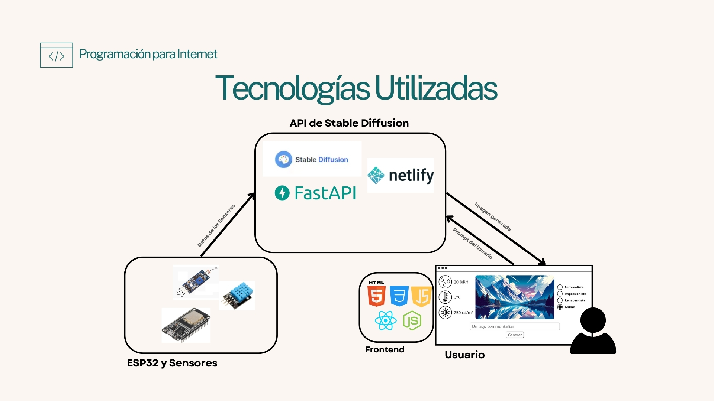

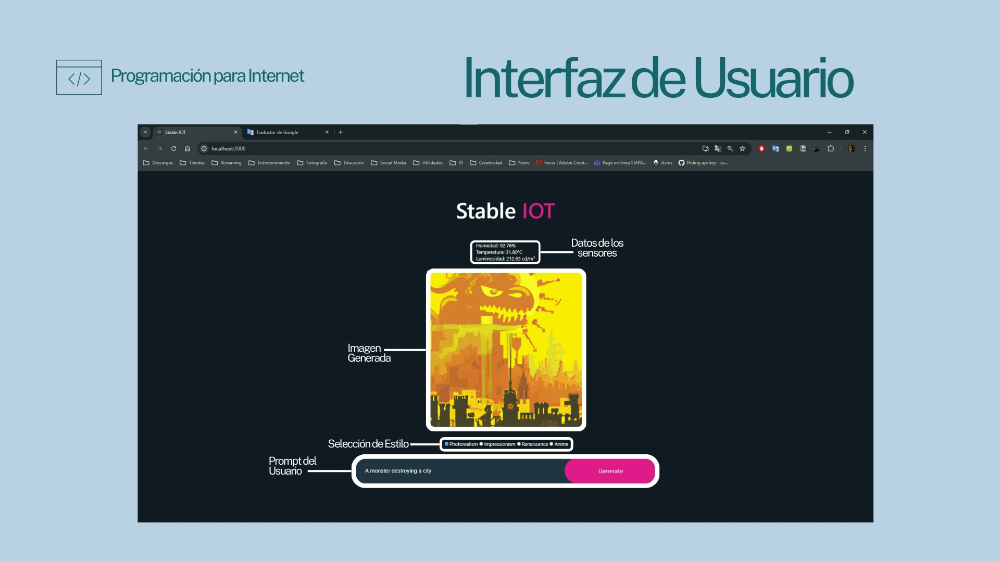