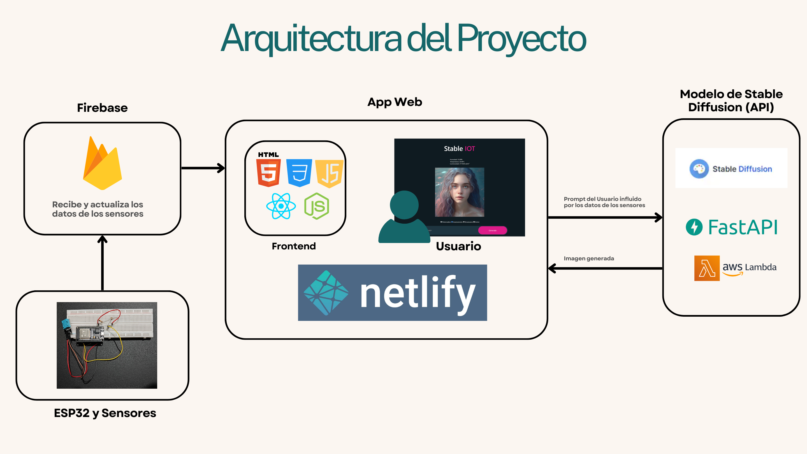

# Stable Diffusion IOT


## Introducción

Nuestro proyecto busca fusionar la inteligencia artificial generativa con los sistemas de IoT para crear una aplicación que genere imágenes  a partir de un prompt ingresado por el usuario, pero influenciado por las condiciones del ambiente percibidas por 3 sensores: temperatura, humedad y luz.

La web la pueden encontrar en el siguiente enlace: [Stable Diffusion IOT](https://rad-llama-f4889e.netlify.app/).

## Arquitectura



La arquitectura de nuestro proyecto funciona de la siguiente manera:

1. La aplicación web es la parte central del flujo de información. Pues aquí es donde se recibe la información de los sensores disponible en firebase. Además es donde el usuario ingresa el prompt y se muestra imagen generada por el modelo.

2. El ESP32 es el encargado de leer y procesar la información de los sensores y enviarla a la base de datos de Firebase.

3. Firebase es la base de datos en la nube que almacena la información de los sensores y la actualiza en tiempo real. Además, es la encargada de enviar la información a la aplicación web.

4. El modelo de inteligencia artificial disponible en AWS Lambda es el encargado de recibir el prompt, generar la imagen y enviarla a la aplicación web.

## Codigo Fuente

Nuestro proyecto tiene una interfaz muy sencilla, por lo que sólo se basa en un componente de React que funciona de la siguiente manera:

### Importaciones

```javascript
import React, { useRef, useState, useEffect } from 'react'
import './ImageGenerator.css'
import default_image from '../Assets/default_image.svg'
import { initializeApp } from "firebase/app";
import { getDatabase, ref, onValue, off } from "firebase/database";
```
- `React` y varios hooks (`useRef`, `useState`, `useEffect`) de la biblioteca React.
- Importa un archivo CSS para estilización.
- Importa una imagen por defecto.
- Importa funciones para inicializar y manejar Firebase.

### Configuración de Firebase

```javascript
const firebaseConfig = {
  apiKey: process.env.REACT_APP_FIREBASE_API_KEY,
  authDomain: process.env.REACT_APP_FIREBASE_AUTH_DOMAIN,
  databaseURL: process.env.REACT_APP_FIREBASE_DATABASE_URL,
  projectId: process.env.REACT_APP_FIREBASE_PROJECT_ID,
  storageBucket: process.env.REACT_APP_FIREBASE_STORAGE_BUCKET,
  messagingSenderId: process.env.REACT_APP_FIREBASE_MESSAGING_SENDER_ID,
  appId: process.env.REACT_APP_FIREBASE_APP_ID
};

// Initialize Firebase
const app = initializeApp(firebaseConfig);
```
- Define la configuración para Firebase utilizando variables de entorno.
- Inicializa la aplicación de Firebase con esta configuración.

### Componente `ImageGenerator`

```javascript
const ImageGenerator = () => {
    const [humidity, setHumidity] = useState(0);
    const [temperature, setTemperature] = useState(0);
    const [brightness, setBrightness] = useState(0);
    
    useEffect(() => {
        const db = getDatabase();
        const databaseRef = ref(db, 'Sensores');

        const onDataChange = (snapshot) => {
            const data = snapshot.val();
            setHumidity(data.sensorHumedad);
            setTemperature(data.sensorTemperatura);
            setBrightness(data.sensorLuminosidad);
        };

        const databaseListener = onValue(databaseRef, onDataChange);

        return () => {
            off(databaseRef, 'value', databaseListener); 
        };
    }, []);
```
- Declara estados para `humidity`, `temperature` y `brightness`.
- Usa `useEffect` para conectar a la base de datos de Firebase y actualizar estos estados cuando los datos cambian.

### Estados y Referencias

```javascript
    const [image_url, setImageUrl] = useState("/");
    let inputRef = useRef(null);
    const [loading, setLoading] = useState(false);
    const [style, setStyle] = useState("photorealism");

    const styles = ["photorealism", "impressionism", "renaissance", "anime"];
```
- Define estados adicionales para `image_url`, `loading` y `style`.
- Utiliza `useRef` para crear una referencia al campo de entrada de texto.

### Funciones Descriptivas

```javascript
    const getHumidityDescription = (humidity) => {
        if (humidity < 10) return "arid";
        if (humidity < 20) return "very dry";
        if (humidity < 30) return "dry";
        if (humidity < 60) return "wet";
        return "rainy";
    };

    const getTemperatureDescription = (temperature) => {
        if (temperature < 5 ) return "freezing"; 
        if (temperature < 10) return "cold";
        if (temperature < 25) return "mild";
        if (temperature < 35) return "hot";
        return "super hot";
    };

    const getBrightnessDescription = (brightness) => {
        if (brightness < 100) return "dark";
        if (brightness < 300) return "dim";
        if (brightness < 700) return "slightly bright";
        return "super bright";
    };
```
- Funciones para traducir los valores de los sensores en descripciones textuales.

### Función de Generación de Imágenes

```javascript
    const ImageGenerator = async () => {
        if (inputRef.current.value === "") {
            return 0;
        }
        const humidityDescription = getHumidityDescription(humidity);
        const temperatureDescription = getTemperatureDescription(temperature);
        const brightnessDescription = getBrightnessDescription(brightness);

        const prompt = `${inputRef.current.value} in a ${brightnessDescription} environment that has a ${temperatureDescription} weather and is ${humidityDescription}, ${style} style`;

        setLoading(true);

        const response = await fetch(
            "https://sdxl.execute-api.mx.amazonaws.com/prod/generate-image",
            {
                method: "POST",
                headers: {
                    "Content-Type": "application/json",
                    Authorization: "Bearer" + " " + process.env.REACT_APP_SD_API_KEY,
                    "User-Agent": "Chrome", 
                },
                body: JSON.stringify({
                    prompt: prompt,
                    model: "sd-xl",
                    n:1,
                    size: "1024x1024"
                }),
            }
        );
        let data = await response.json();
        let data_array = data.data;
        setImageUrl(data_array[0].url);
        setLoading(false);
    }
```
- Define una función asíncrona para generar imágenes usando la API de nuestro modelo de stable diffusion.
- Crea un prompt basado en la entrada del usuario y las descripciones de los sensores.
- Hace una solicitud `fetch` a la API de para generar una imagen.
- Actualiza el estado `image_url` con la URL de la imagen generada y gestiona el estado de carga.

### Renderizado del Componente

```javascript
    return (
        <div className='ai-image-generator'>
            <div className="header">Stable <span> IOT </span> </div>
            <div className="sensor-readings">
                <div>Humedad: {humidity.toFixed(2)}%</div>
                <div>Temperatura: {temperature.toFixed(2)}°C</div>
                <div>Luminosidad: {brightness.toFixed(2)} cd/m²</div>
            </div>
            <div className="img-loading">
                <div className="image"></div>
                <div className="loading">
                    <div className={loading?"loading-bar-full":"loading-bar"}></div>
                    <div className={loading?"loading-text":"display-none"}>Loading...</div>
                </div>
            </div>
            <div className="style-selector">
                {styles.map((s) => (
                    <label key={s}>
                        <input
                            type="radio"
                            value={s}
                            checked={style === s}
                            onChange={() => setStyle(s)}
                        />
                        {s.charAt(0).toUpperCase() + s.slice(1)}
                    </label>
                ))}
            </div>
            <div className="search-box">
                <input type="text" ref={inputRef} className= 'search-input' placeholder='Describe your image' />
                <div className="generate-btn" onClick={()=>{ImageGenerator()}}>Generate</div>
            </div>
        </div>
    )
}

export default ImageGenerator;
```
- Renderiza el componente, mostrando las lecturas de los sensores, una imagen (por defecto o generada), una barra de carga y un selector de estilo.
- Proporciona una caja de búsqueda donde el usuario puede describir la imagen deseada.
- Incluye un botón para generar la imagen basada en la descripción del usuario y el estilo seleccionado.


## Guía de Usuario

La aplicación es muy facil de usar, pues no requiere registro ni autenticación. Sólo se necesita ingresar a la página web y se mostrará la interfaz principal donde el usuario podrá ingresar un prompt, por ejemplo "A beautiful sunset in a forest". La aplicación enviará el prompt al modelo de inteligencia artificial y mostrará la imagen generada.


El usuario también podrá seleccionar el estilo de la imagen generada, entre los siguientes:

- Fotorealista
- Impresionista
- Renacentista
- Anime

### Estilo Impresionista


### Estilo Renacentista


### Estilo Anime


Eso sí, los datos de los sensores dependen de nuestro dispositivo ESP32, por lo que aparte de necesitar estar conectado, la modificaciones del prompt dependerán de las condiciones del ambiente en el que se encuentre el dispositivo.


